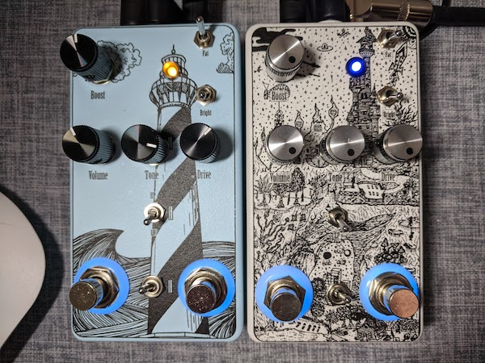
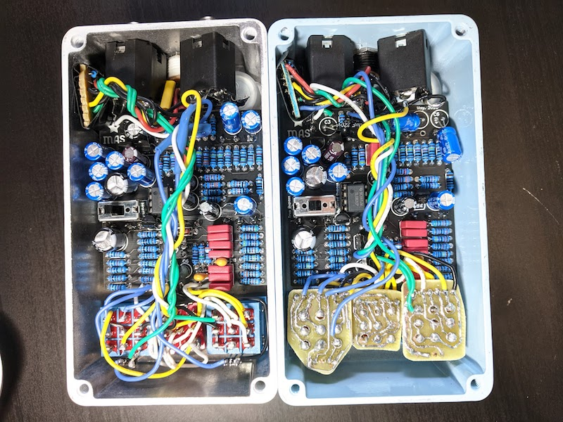
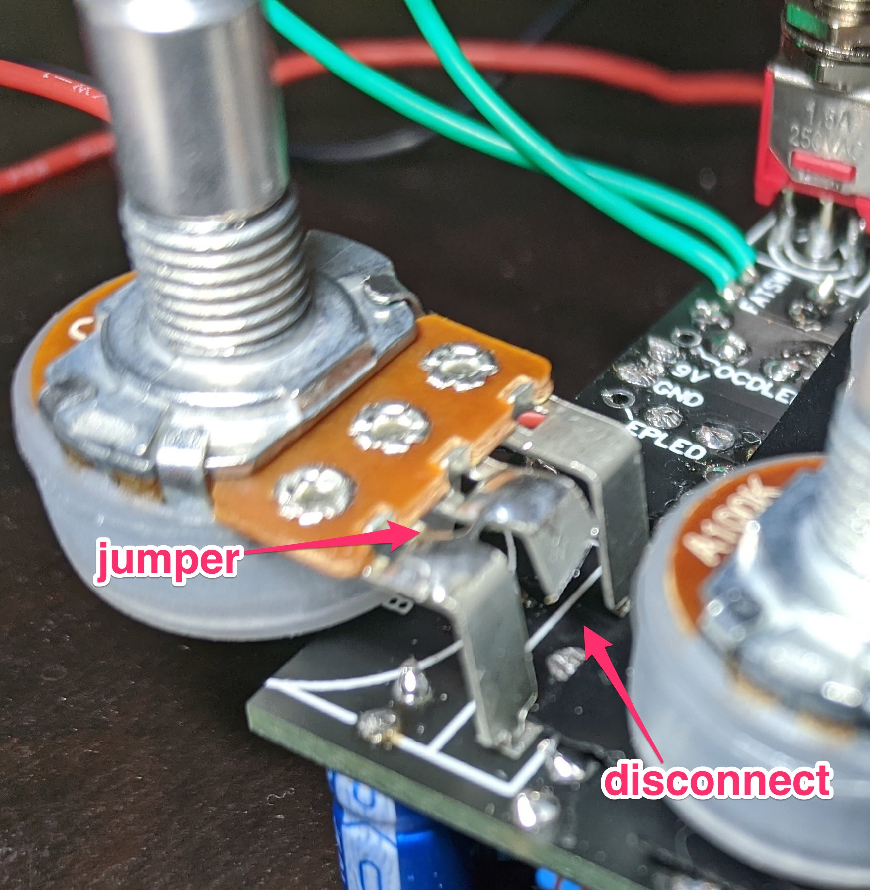
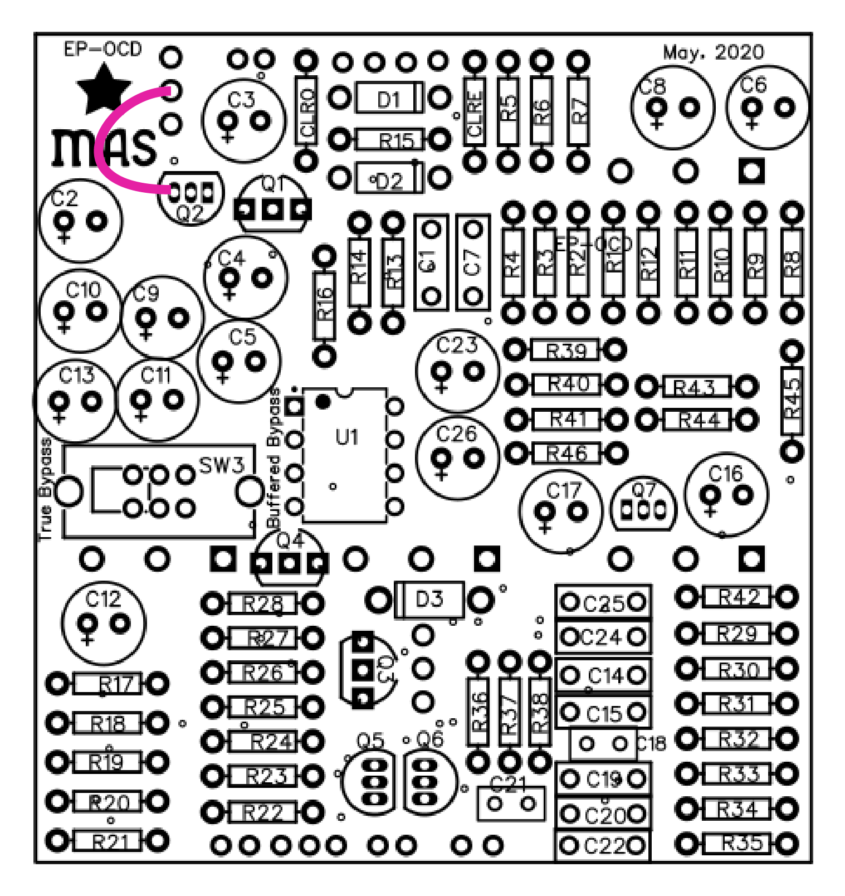

# EP + OCD v2

This is an EP Booster and OCD v2 in a single 125 enclosure.

[You can buy a PCB here](https://mas-effects.square.site/product/ocd-ep-booster-board/19?cp=true&sa=true&sbp=false&q=false). Alternatively this repository contains everything you need to build it on your own.

## Warning

This pedal fits a LOT of components into a very tight space.  It requires some tricky soldering and a bit of planning.

Most notably:

* fitting the top-mounted jacks might require leaving longer legs on some caps to bend them out of the way. And/or cutting unused legs off the jacks.
* soldering the pots requires working in very tight spots. You can make it a bit easier by leaving some capacitors off before adding the pots, but just be sure their holes aren't blocked by the pot.

## Assembly

* Sorry I don't have a detailed assembly guide, and probably won't write one, but email me if you have questions: mark@mas-effects.com.  See the documents in these folders:
  * [bill-of-materials](bill-of-materials/)
  * [assembly](assembly/)
  * [schematic](schematic/)
  * [pcb](pcb/) *(if you want to fabricate your own)*
* *Note*: The ["lighthouse" LED](assembly/offboard-wiring-LEDs.png) is totally optional, and you'll probably want to omit it.
* **FIXES required**: If you fabricate your own PCBs from the gerber files, they should work without modification.  But if you purchased a PCB from me there are 2 important fixes to make:

### Fix 1: Boost Pot

1. Cut off leg 2 of the boost pot. i.e. don't connect it to the board.
2. Solder a jumper from leg 2 to leg 1

### Fix 2: Missing trace

Solder a jumper wire from the base of Q2 to middle leg of the SW2 (bright switch).

